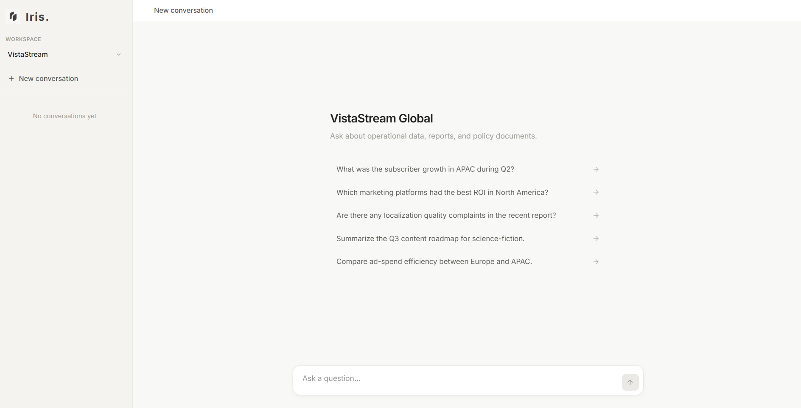
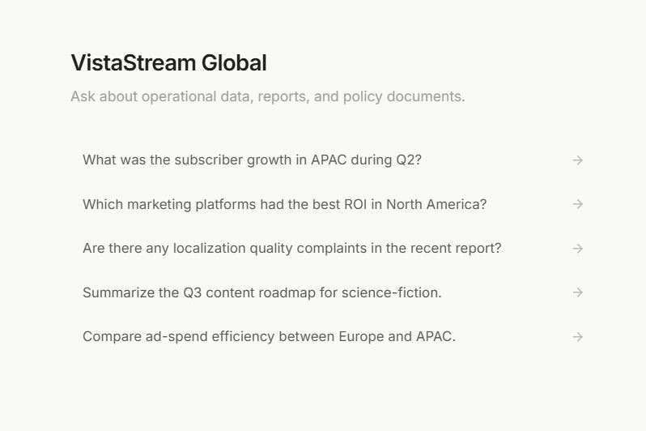
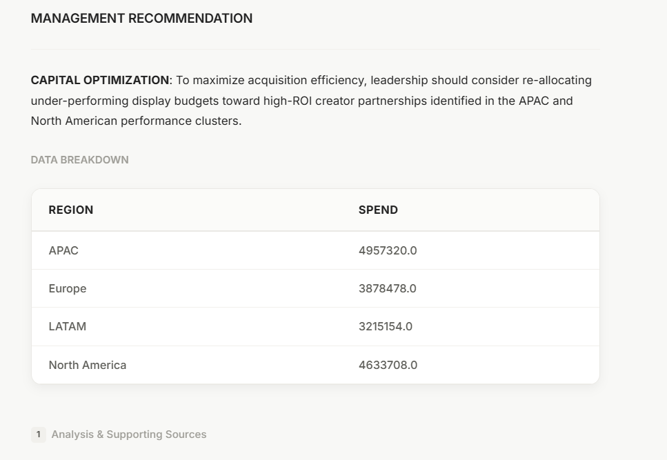
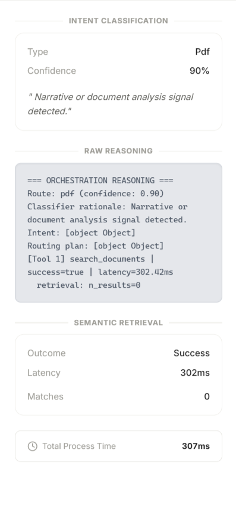
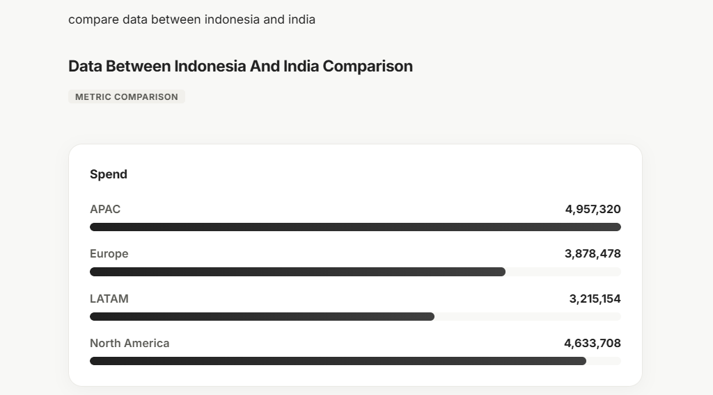
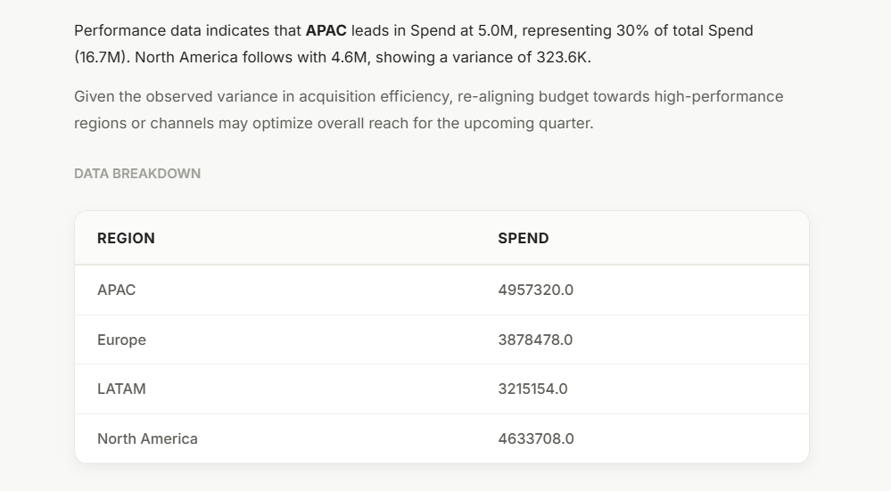
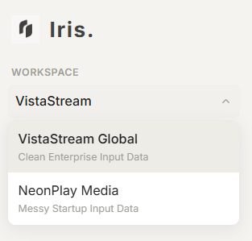
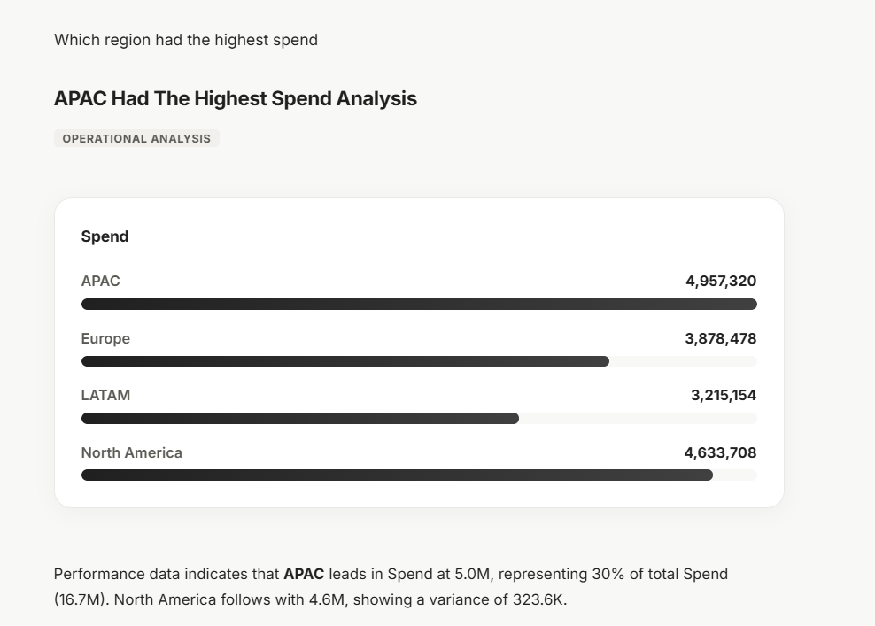
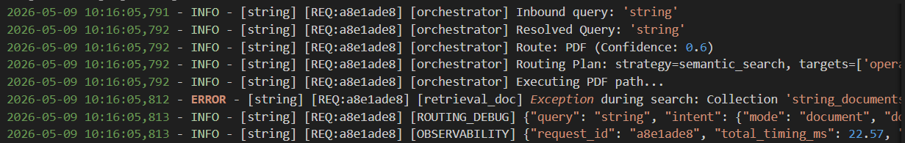

# Iris.

Operational Intelligence Platform for Management Analytics

---

## Overview

Iris is a management-focused operational intelligence platform built to combine structured analytics, document intelligence, and conversational querying inside a single workspace.

The system connects:

* Structured operational data (SQLite)
* Internal reports and PDFs (ChromaDB semantic retrieval)
* Deterministic orchestration
* Executive-focused response synthesis
* Explainable source tracing

The goal was to build a system that feels reliable and understandable for management users instead of feeling like a generic AI chatbot.

The project was intentionally designed around:

* deterministic routing
* explainable answers
* operational traceability
* structured retrieval
* readable management responses
* lightweight infrastructure

---

# Product Philosophy

Most AI assistants either:

* hallucinate confidently
* expose raw retrieval chunks
* behave inconsistently between queries
* or hide reasoning completely.

Iris was built with a different approach.

Instead of letting an LLM control the entire pipeline, the system uses deterministic orchestration first and generative synthesis last.

The LLM is used only after:

* routing
* retrieval
* validation
* filtering
* context selection

This keeps responses grounded in actual operational evidence.

---

# Core Features

## Operational Analytics

Structured analytics over:

* regional performance
* marketing ROI
* watch activity
* ingestion quality
* validation warnings
* operational anomalies
* campaign performance

The platform supports:

* tables
* visual summaries
* KPI comparisons
* management-focused synthesis

---

## Semantic Document Intelligence

PDF reports are indexed into vector embeddings and retrieved semantically.

Supported document categories:

* executive reports
* strategy roadmaps
* audience behaviour reports
* operational reports
* governance policies
* engineering planning documents

The system retrieves only relevant excerpts instead of exposing entire documents.

---

## Deterministic Orchestration

Queries are classified before retrieval.

The system routes requests into:

* SQL analytics
* operational log analysis
* semantic document retrieval
* conversational handling

This avoids generic "search everything" behavior.

The orchestration layer was built manually instead of using large orchestration frameworks so routing behavior remains predictable and explainable.

---

## Supporting Sources

Every answer includes supporting sources.

Users can inspect:

* source documents
* retrieved excerpts
* confidence indicators
* related operational evidence

The goal was to make responses feel auditable instead of opaque.

---

## Workspace-Based Isolation

Each workspace has isolated:

* SQLite databases
* vector collections
* retrieval pipelines
* operational context

Current included workspaces:

* VistaStream Global (clean enterprise environment)
* NeonPlay Media (messy startup environment)

This demonstrates both:

* analytical quality
* operational resilience

---

## Conversational Continuity

The assistant supports:

* follow-up explanations
* clarification questions
* contextual continuation
* conversational restructuring

Examples:

* “Explain further”
* “What do you mean by that?”
* “Can you summarize this better?”

Conversation continuity is intentionally constrained to avoid stale-context contamination.

---

# Architecture

## High-Level Flow

```text
User Query
↓
Frontend Workspace UI
↓
FastAPI API Layer
↓
Intent Classification
↓
Route Planning
↓
┌─────────────────────────────┐
│ Structured SQL Analytics   │
│ Semantic PDF Retrieval     │
│ Operational Log Analysis   │
│ Conversational Handling    │
└─────────────────────────────┘
↓
Retrieval Validation
↓
Response Synthesis
↓
Table / Chart Formatting
↓
Supporting Sources
↓
Management Response
```

---

## System Architecture

```text
                        ┌─────────────────────┐
                        │      Frontend       │
                        │ React + TypeScript  │
                        └──────────┬──────────┘
                                   │
                                   ▼
                        ┌─────────────────────┐
                        │    FastAPI Layer    │
                        │  Session Handling   │
                        │   API Contracts     │
                        └──────────┬──────────┘
                                   │
                                   ▼
                    ┌───────────────────────────┐
                    │   Orchestration Engine    │
                    │ Intent + Route Planning   │
                    └───────┬─────────┬────────┘
                            │         │
             ┌──────────────┘         └──────────────┐
             ▼                                       ▼
 ┌────────────────────┐                 ┌────────────────────┐
 │ Structured Queries │                 │ Semantic Retrieval │
 │ SQLite Analytics   │                 │ ChromaDB + PDFs    │
 └─────────┬──────────┘                 └─────────┬──────────┘
           │                                      │
           └──────────────┬───────────────────────┘
                          ▼
              ┌──────────────────────┐
              │ Retrieval Validation │
              │ Evidence Selection   │
              └──────────┬───────────┘
                         ▼
              ┌──────────────────────┐
              │ Gemini Synthesis     │
              │ Structured Responses │
              └──────────┬───────────┘
                         ▼
              ┌──────────────────────┐
              │ Tables + Charts      │
              │ Supporting Sources   │
              └──────────────────────┘
```

---

## Backend Components

### FastAPI

Handles:

* API routing
* session handling
* orchestration requests
* health checks
* structured responses

---

### SQLite

Used for:

* operational datasets
* ingestion logs
* validation tracking
* session persistence
* structured analytics

SQLite was chosen intentionally because:

* setup is zero friction
* portability matters more than distributed scale for this project
* reviewers should be able to clone and run immediately

---

### ChromaDB

Used for:

* vector embeddings
* semantic retrieval
* PDF indexing
* source retrieval

Embeddings are generated locally using:

```text
all-MiniLM-L6-v2
```

This avoids external retrieval latency and keeps retrieval inexpensive.

---

### Gemini

Gemini is used only for:

* synthesis
* summarization
* response restructuring
* conversational formatting

Gemini does NOT:

* generate raw SQL
* directly access databases
* directly access PDFs
* control orchestration

This separation was intentional.

---

# Technology Stack

## Frontend

* React
* TypeScript
* Vite
* Vanilla CSS
* Custom design system
* Chart rendering

---

## Backend

* Python 3.11
* FastAPI
* Pydantic
* SQLite
* ChromaDB
* Sentence Transformers

---

## AI Layer

* Gemini API
* all-MiniLM-L6-v2 embeddings

---

## Infrastructure

* Docker
* Docker Compose
* Persistent mounted volumes

---

# Project Structure

```text
futures-first/
│
├── backend/
│   ├── api/
│   ├── orchestration/
│   ├── ingestion/
│   ├── verification/
│   ├── tests/
│   ├── bootstrap.py
│   ├── config.py
│   ├── schemas.py
│   └── system_health.py
│
├── frontend/
│   ├── src/
│   ├── components/
│   ├── pages/
│   ├── hooks/
│   ├── services/
│   └── styles/
│
├── data/
│   ├── enterprise_clean_data/
│   └── startup_messy_data/
│
├── databases/
│   ├── vistastream.db
│   └── neonplay.db
│
├── chroma/
│   └── vector_collections/
│
├── docs/
│   ├── architecture/
│   ├── engineering/
│   └── reports/
│
├── logs/
│
├── requirements.txt
├── requirements-dev.txt
├── docker-compose.yml
├── Dockerfile
└── README.md
```

---

# Security & Safety Decisions

## SQL Safety

The SQL layer:

* validates table access
* blocks unsafe keywords
* prevents schema leakage
* rejects dangerous query structures
* enforces read-only access

---

## Workspace Isolation

Each workspace is isolated.

This prevents:

* cross-workspace leakage
* mixed retrieval contamination
* operational confusion

---

## Source-Constrained Synthesis

The synthesizer only receives:

* validated SQL results
* filtered retrieval chunks
* bounded operational evidence

This reduces hallucination risk.

---

## Domain Restrictions

The assistant intentionally blocks:

* code generation
* explicit content
* unrelated tutoring
* jailbreak attempts

The goal is to keep the platform focused on operational intelligence workflows.

---

# Operational Intelligence Features

## Structured Tables

The system automatically converts:

* KPI comparisons
* regional metrics
* performance breakdowns
* operational summaries

into readable tables.

---

## Visualizations

Supported visual types:

* bar charts
* line charts
* pie charts
* KPI cards

Charts are generated from structured backend metrics instead of hallucinated LLM output.

---

## Operational Anomaly Analysis

The platform supports:

* warning analysis
* duplicate detection
* validation failures
* ingestion inconsistencies
* normalization tracking

This became a major focus during orchestration stabilization.

---

# UI Screenshots

## Landing Workspace

<p align="center">
  
</p>

Clean management-focused workspace with:
- workspace isolation
- suggested operational queries
- persistent conversations
- low-cognitive-load layout

---

## Management Query Example

<p align="center">
  
  
</p>

Example executive-style operational query showing:
- management-focused synthesis
- structured analytics
- conversational workflow
- operational summaries

---

## Supporting Sources Panel

<p align="center">
  
</p>

Traceability panel showing:
- routing classification
- retrieval reasoning
- supporting evidence
- structured vs semantic retrieval flow
- operational source transparency

---

## Operational Visualization

<p align="center">
  
  
</p>

Structured visual analytics generated from validated operational data:
- KPI comparison cards
- metric visualizations
- executive-readable summaries
- supporting operational evidence

---

## Workspace Isolation

<p align="center">
  
</p>

Workspace-based operational separation between:
- VistaStream Global (enterprise-grade clean data)
- NeonPlay Media (messy startup environment)

Each workspace maintains isolated:
- databases
- retrieval collections
- orchestration context
- conversation history

---

## Conversational Analytics

<p align="center">
  
</p>

Multi-turn management conversations with:
- conversational continuity
- follow-up explanations
- contextual reasoning
- operational evidence grounding

---

## Ingestion & Operational Monitoring

<p align="center">
  
</p>

Operational monitoring and ingestion-quality analysis including:
- warning detection
- duplicate tracking
- validation failures
- operational anomaly summaries

---

# Example Queries

## Operational Analytics

* Which regions had the strongest growth?
* Compare APAC vs Europe ROI.
* Why are there so many validation warnings?
* Show watch activity inconsistencies.
* Summarize Q2 performance.

---

## Strategic Questions

* What are the roadmap priorities for Q3?
* What operational risks were mentioned recently?
* What are the localization complaints in APAC?
* Summarize executive commentary.

---

## Conversational Queries

* Explain further.
* What do you mean by scalable growth?
* Can you summarize this better?
* Give me a quick overview.

---

# Docker Setup

## Quick Start

### ⚠️ Critical First Step: API Key Configuration

Before running Docker, configure environment variables.

The platform uses the Google Gemini API for:

* response synthesis
* conversational reasoning
* management summaries
* structured answer generation

---

## Clone Repository

```bash
git clone <repository>
cd futures-first
```

---

## Configure Environment Variables

Create a local `.env` file:

```bash
cp .env.example .env
```

Open the `.env` file and add:

```text
GEMINI_API_KEY=your_actual_api_key_here
```

---

## Launch Everything

```bash
docker compose up --build
```

---

## What Happens Automatically

On first startup the system will:

* build frontend and backend containers
* initialize databases
* ingest CSV datasets
* process PDF documents
* generate vector embeddings
* initialize retrieval pipelines
* start API services
* start frontend services

On future startups:

* bootstrap is skipped automatically
* databases persist through Docker volumes
* vector collections persist through Docker volumes

---

## Access URLs

Frontend:

```text
http://localhost:5173
```

Backend API:

```text
http://localhost:8000
```

---

## Important Note

The system can boot without a `GEMINI_API_KEY`.

However:

* conversational synthesis
* management summaries
* reasoning generation
* response restructuring

will be disabled.

Core infrastructure and retrieval layers will still function.

---

# Local Development

## Backend

```bash
pip install -r requirements.txt
python -m backend.bootstrap
uvicorn backend.api.app:app --reload
```

---

## Frontend

```bash
cd frontend
npm install
npm run dev
```

---

# Validation & Testing

The system includes:

* orchestration regression tests
* SQL guard validation
* retrieval validation
* ingestion verification
* conversational continuity checks
* security checks

The orchestration regression suite was used heavily during stabilization to identify:

* routing failures
* retrieval contamination
* entity extraction issues
* conversational inheritance bugs

---

# Future Improvements

Planned future improvements include:

* custom workspace uploads
* dynamic schema onboarding
* richer visualization support
* collaborative sessions
* exportable management reports
* multi-user deployment
* advanced retrieval evaluation

---

# Final Notes

The project evolved significantly during development.

The largest engineering effort ended up being:

* orchestration reliability
* retrieval correctness
* conversational continuity
* synthesis quality

The final architecture intentionally favors:

* predictable behavior
* operational grounding
* explainable retrieval
* management readability

over:

* autonomous agents
* opaque orchestration
* excessive abstraction
* generic chatbot behavior
