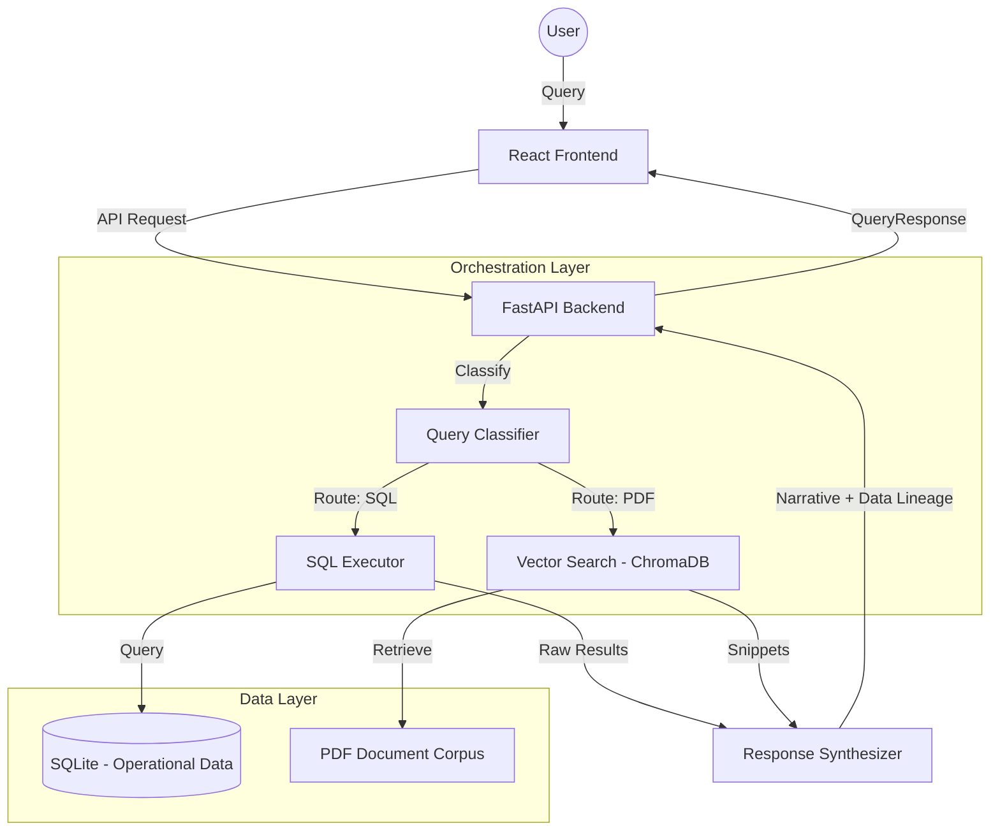

# Iris. — Operational Intelligence Platform

Iris is a premium operational intelligence engine designed to bridge the gap between unstructured narrative evidence (PDFs) and structured analytical data (SQL). It provides executives with a unified interface to query regional performance, strategic roadmaps, and ingestion quality metrics with built-in data lineage.

## 🏛 Architecture Overview

Iris uses a **Deterministic Orchestrator** pattern that ensures reliability by classifying intent before executing specialized retrieval tools.

## ✨ Key Features

- **Hybrid Intelligence**: Routes queries between structured SQL analytics (for spend/ROI) and semantic document search (for strategy/highlights).
- **Executive Data Lineage**: A dedicated transparency panel that reveals the "Raw Reasoning" behind every answer, including document result IDs, confidence scores, and source page numbers.
- **Dynamic Response Synthesis**: Automatically converts raw data fragments into polished management-grade narratives with bolded metrics and structured tables.
- **Intelligent Routing**: Deterministically detects operational domains (Anomaly Detection, Product Strategy, etc.) to ensure the right data source is used every time.

## 💻 Technology Stack

- **Frontend**: React, TypeScript, Vite, Lucide Icons, Vanilla CSS (Premium Custom Design).
- **Backend**: Python 3.11, FastAPI, Pydantic.
- **Search & Storage**: 
  - **ChromaDB**: For vector embeddings and semantic search.
  - **SQLite**: For structured operational data and session persistence.
  - **Sentence Transformers**: Local embedding generation (`all-MiniLM-L6-v2`).
- **Intelligence**: Google Gemini Pro (via Generative AI SDK) for response synthesis.

## 📂 Project Structure

- `/backend`: Core logic, orchestration, and API services.
- `/frontend`: React application and custom design system.
- `/data`: Source CSVs and dataset definitions.
- `/docs`: PDF corpus for semantic retrieval.
- `/databases`: Persistent SQLite storage.
